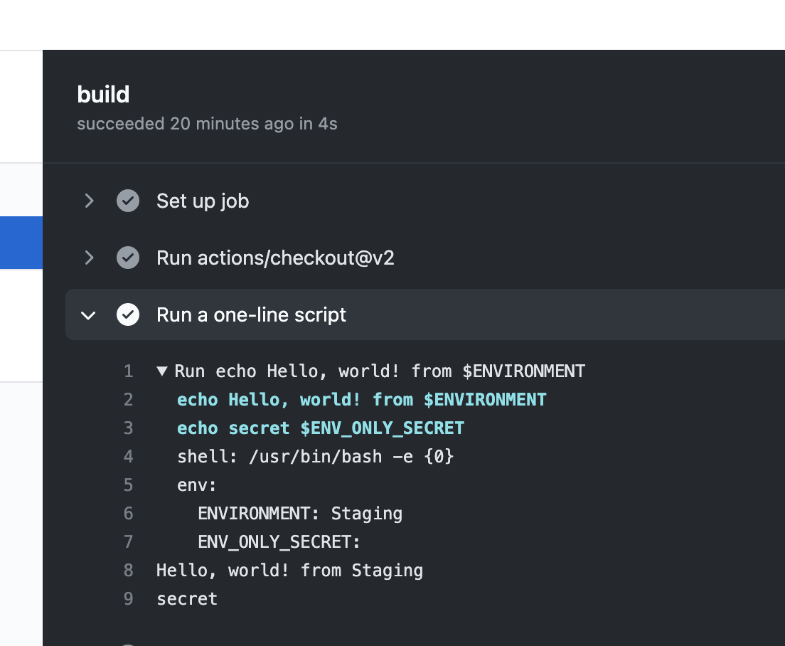

# example-github-flow-deployment

Most of the software companies are using `git` as version control system. There are several ways of working with `git`.
Initial purpose of having version control system for the codebase was having an identical and manageable code sharing
between team members.

Nowadays, that is not enough for modern applications. We also need to consider testability, easy to deploy, and
supporting multiple environments.

With this repo, I'll setup a basic demo for GitHub Flow + GitHub Actions

## Steps

Start with protecting your `main` branch.


Create a CI file under `.github/workflows` folder and `.yml` file with any name. I've started with hello-world example
from `GitHub`.

Later on we need to set our triggers; We need a manual trigger for enabling us to choose any branch and set target to be
deployed.

```yaml
on:
  workflow_dispatch:
    inputs:
      environment:
        description: 'Name of environment to deploy'
        required: true
        default: 'Staging'
```

After merging these changes to `main` branch, we can trigger the pipeline with using any branch and target env name.


Let's run it against `Staging` env. Default value of ENVIRONMENT was `Develop` but it should be overridden as `Staging`.




This flow creates ENVs automagically for us! Same goes for other ENVs once we created them.


## Some good articles

* https://nvie.com/posts/a-successful-git-branching-model/
* https://medium.com/@patrickporto/4-branching-workflows-for-git-30d0aaee7bf
* https://softwareengineering.stackexchange.com/questions/263164/why-squash-git-commits-for-pull-requests
* http://scottchacon.com/2011/08/31/github-flow.html
* https://www.gitkraken.com/learn/git/best-practices/git-branch-strategy
* https://salimkayabasi.com/blog/2021/05/better-github-flow-with-using-github-actions/
